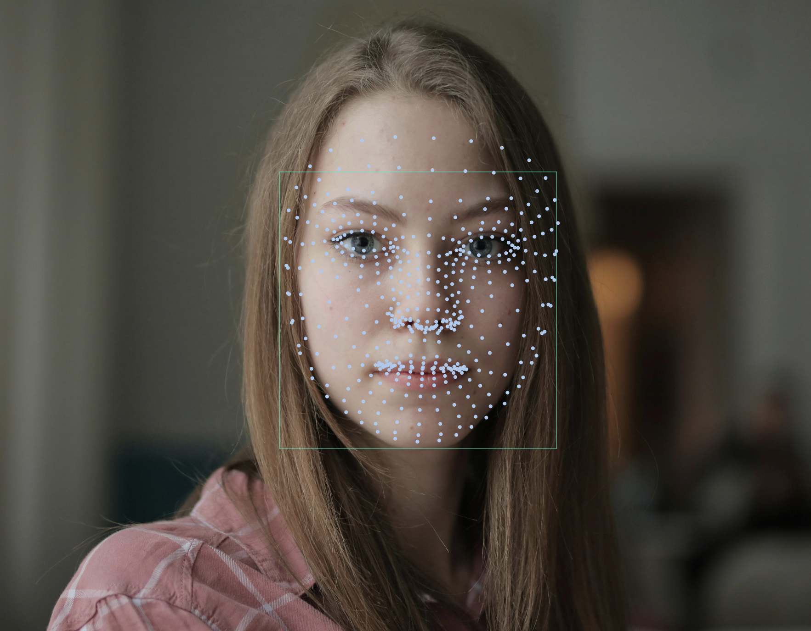
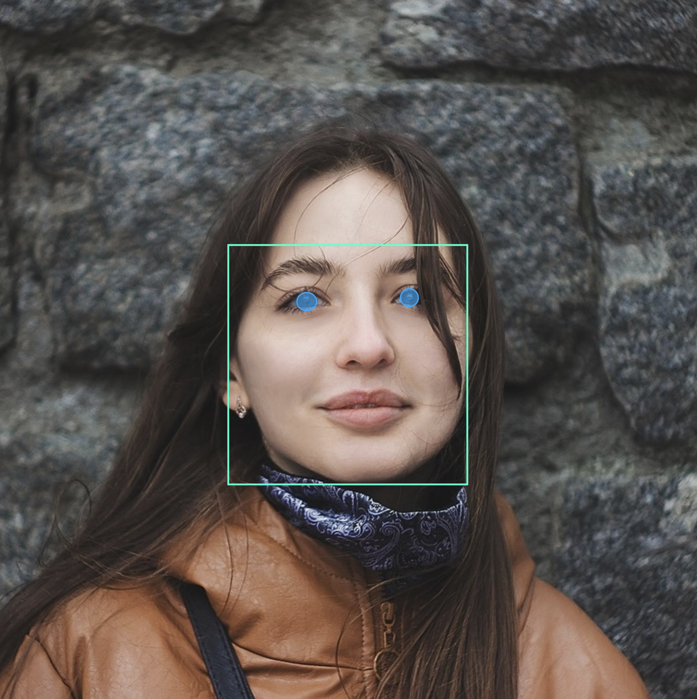

# face_detection_tflite

A pure Dart/Flutter implementation of Google's MediaPipe face detection and facial landmark models using TensorFlow Lite. 
This package provides on-device face and landmark detection with minimal dependencies, just TensorFlow Lite and image.

#### Bounding Box Example:


#### Mesh (468-Point) Example:



#### Landmark Example:


#### Iris Example:



## Table of Contents

- [Features](#features)
- [Quick Start](#quick-start)
- [Models](#models)
- [Types](#types)
- [Example](#example)
- [Inspiration](#inspiration)

## Features

- On-device face detection (multiple SSD variants)
- 468-point face mesh, face landmarks, iris landmarks and bounding boxes
- All coordinates are in **absolute pixel coordinates** (`Point<double>`)
  - `x` ranges from `0` to `image.width`
  - `y` ranges from `0` to `image.height`
  - Ready to use co-ordinates without any scaling
- Truly cross-platform: compatible with Android, iOS, macOS, Windows, and Linux
- The `example/` app illustrates how to detect and render results on images: bounding boxes, a 468-point face mesh, and iris landmarks.

## Quick Start

```dart
import 'dart:io';
import 'package:face_detection_tflite/face_detection_tflite.dart';

Future main() async {
  // 1. initialize
  final detector = FaceDetector();
  await detector.initialize(model: FaceDetectionModel.backCamera);

  // 2. detect
  final imageBytes = await File('path/to/image.jpg').readAsBytes();
  final result = await detector.detectFaces(imageBytes);

  // 3. access results
  for (final face in result.faces) {
    final landmarks = face.landmarks;
    final bbox = face.bboxCorners;  
    final mesh = face.mesh;     
    final irises = face.irises;
    
    final leftEye = landmarks[FaceIndex.leftEye];
    final rightEye = landmarks[FaceIndex.rightEye];

    print('Left eye: (${leftEye.x}, ${leftEye.y})');
  }

  // 4. clean-up
  detector.dispose();
}
```

## Face Detection Modes

This app supports three detection modes that determine which facial features are detected:

| Mode | Features | Est. Time per Face* |
|------|----------|---------------------|
| **Full** (default) | Bounding boxes, landmarks, 468-point mesh, iris tracking | ~80-120ms           |
| **Standard** | Bounding boxes, landmarks, 468-point mesh | ~60ms               |
| **Fast** | Bounding boxes, landmarks | ~30ms               |

*Est. times per faces are based on 640x480 resolution on modern hardware. Performance scales with image size and number of faces.

### Code Examples
```dart
// full mode (default): bounding boxes, 6 basic landmarks + mesh + iris
// note: full mode provides superior accuracy for left and right eye landmarks
// compared to fast/standard modes. use full mode when precise eye landmark
// detection is required for your application. trade-off: longer inference
await _faceDetector.detectFaces(bytes);

// standard mode: bounding boxes, 6 basic landmarks + mesh. inference time 
// is faster than full mode, but slower than fast mode.
await _faceDetector.detectFaces(bytes, mode: FaceDetectionMode.standard);

// fast mode: bounding boxes + 6 basic landmarks only. fastest inference 
// time of the three modes.
await _faceDetector.detectFaces(bytes, mode: FaceDetectionMode.fast);
```

Try the [sample code](https://pub.dev/packages/face_detection_tflite/example) from the pub.dev example tab to easily compare
modes and inferences timing. 

## Models

You can choose from several detection models depending on your use case:

- **FaceDetectionModel.backCamera**: larger model for group shots or images with smaller faces (default).
- **FaceDetectionModel.frontCamera**: optimized for selfies and close-up portraits.
- **FaceDetectionModel.short**: best for short-range images (faces within ~2m).
- **FaceDetectionModel.full**: best for mid-range images (faces within ~5m).
- **FaceDetectionModel.fullSparse**: same detection quality as `full` but runs up to 30% faster on CPU (slightly higher precision, slightly lower recall).

## Types

- `FaceResult` contains `bboxCorners`, `mesh`, `irises` and `landmarks`.
- `face.landmarks` is a `Map<FaceIndex, Point<double>>`, where `FaceIndex` is one of:
    - `FaceIndex.leftEye`
    - `FaceIndex.rightEye`
    - `FaceIndex.noseTip`
    - `FaceIndex.mouth`
    - `FaceIndex.leftEyeTragion`
    - `FaceIndex.rightEyeTragion`
- All coordinates are **absolute pixel positions**, ready to use for drawing or measurement.

## Example

The [sample code](https://pub.dev/packages/face_detection_tflite/example) from the pub.dev example tab includes a 
Flutter app that paints detections onto an image: bounding boxes, landmarks, mesh, and iris. The 
example code provides inference time, and demonstrates when to use `FaceDetectionMode.standard` or `FaceDetectionMode.fast`.  

## Inspiration

At the time of development, there was no open-source solution for cross-platform, on-device face and landmark detection.
This package took inspiration and was ported from the original Python project **[patlevin/face-detection-tflite](https://github.com/patlevin/face-detection-tflite)**. Many thanks to the original author.